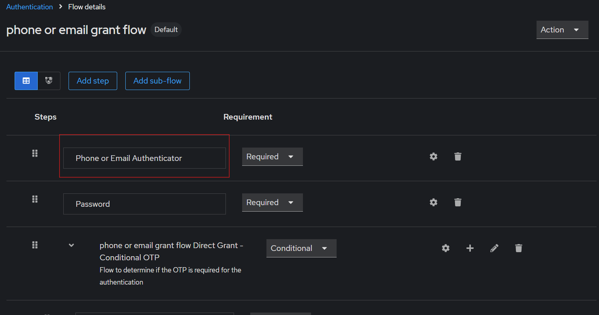

# Keycloak - Phone or Email authentication provider

This project is a java implementation for keycloak auth providers.</br> 
This provider in particular is being used in one of my mobile applications, to allow users to authenticate by giving a phoneNumber or email as their user.

## Instructions
- Run ```mvn clean package``` to generate the .jar file in target
- Put the generated .jar now located in target in opt/keycloak/providers (Keycloak version 24.X.X), of you keycloak instance
- In the Server running your instance of keycloak (if it is a standalone instance) go to /opt/keycloak/bin and run ```./kc.sh build``` . In my case I was running on docker, so I had to run ```docker exec -it <container ID> /bin/bash``` to access the container first.
- Restart the instance, and you can now find the execution called **Phone or Email Authenticator**. Use it in the flow you wish to change. In my case it was the Direct grant flow.
- I sugest you create a clone of the flow change it as shown bellow and the bind it to the Direct grant flow. 

<br>
<br>



#### HOPE THIS HELPS